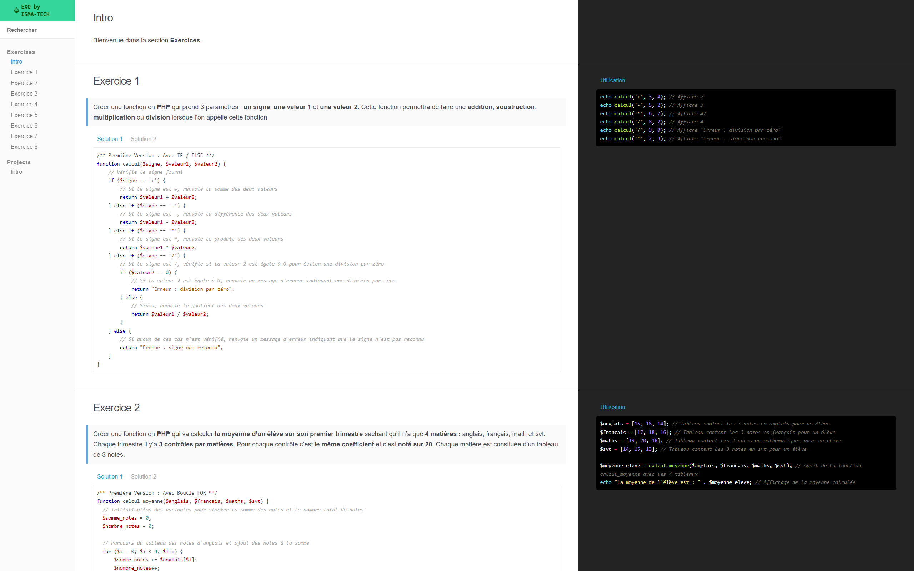

# EXO by ISMA-TECH

[**EXO by ISMA-TECH**](https://exo.isma-tech.fr) est un site regroupant une liste d'exercice pour apprendre à coder à destination de mon élève Ismael Ibrahima [Ismael Ibrahima](https://www.linkedin.com/in/ismael-ibrahima-a2920882/).

## A Propos

---

**Nom:** Salim Benfarhat  
**Email:** [hello@salim.link](mailto:hello@salim.link)  
**WhatsApp:** [Mon WhatsApp](https://salim.link/whatsapp)  
**Carte De Visite Digitale (C2VD):** [SALIM.LINK](https://salim.link)  
**Agence Web:** [MARSWEB.FR](https://marsweb.fr)  
**LinkedIn:** [Mon Profil LinkedIn](https://salim.link/linkedin)  
**Faire un don:** [Mon Paypal](https://salim.link/paypal)

N'hésitez pas à me contacter pour discuter de vos besoins en matière de prestations web. Je serais ravi de collaborer avec vous !

N'hésitez pas à me contacter pour explorer des opportunités passionnantes dans le monde du développement web. En tant que créateur d'EXO by ISMA-TECH, je suis passionné par l'apprentissage et le partage de connaissances, et je suis prêt à mettre mes compétences au service de votre projet. Que vous ayez besoin de conseils, de développement sur mesure ou de solutions web innovantes, je suis là pour vous aider à concrétiser vos idées.

Ensemble, nous pouvons créer des expériences web exceptionnelles. Alors, n'attendez plus, prenez contact avec moi et faisons de votre vision une réalité. Je suis impatient de discuter de vos projets et de collaborer avec vous pour les concrétiser. Contactez-moi dès aujourd'hui !
